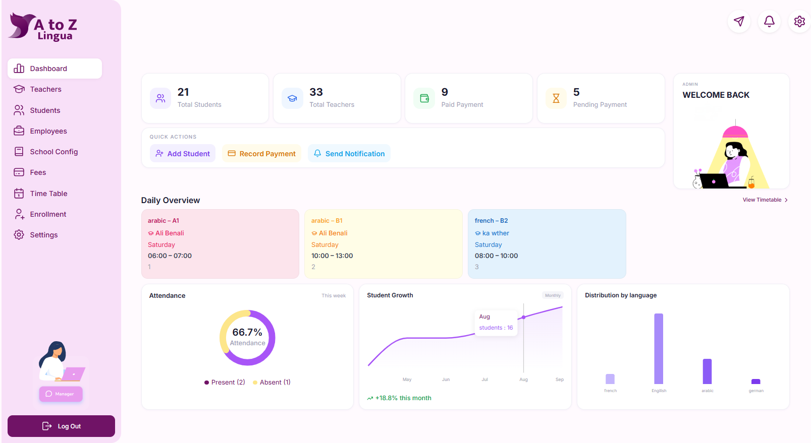
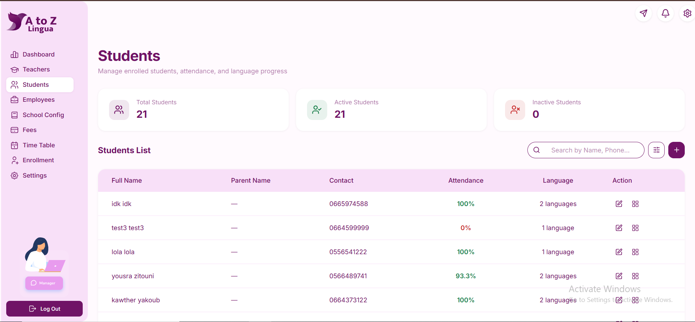
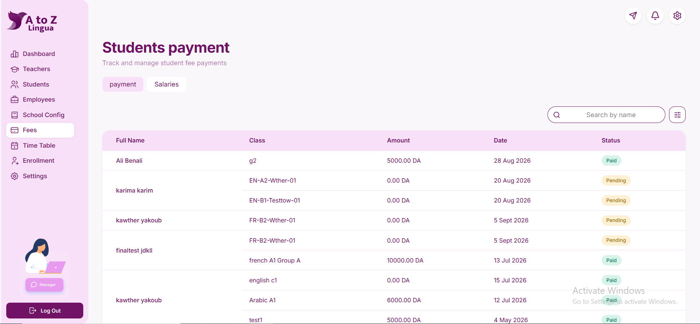
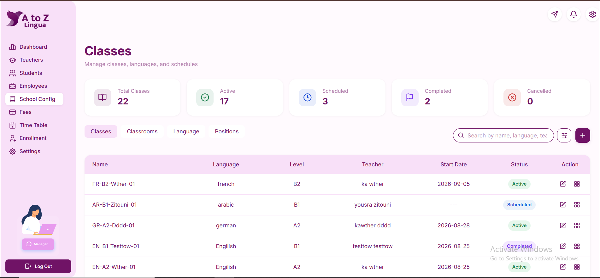
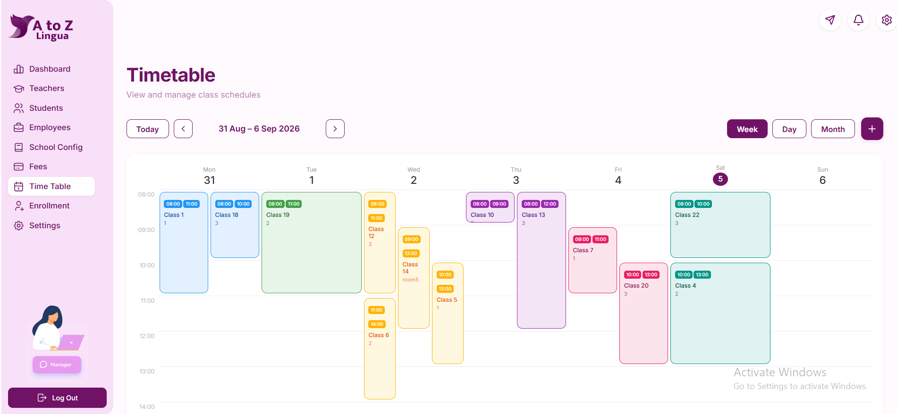

# A to Z Lingua

Language School Management System


##  About the Project

**A to Z Lingua** is a web-based language school management system built to make managing students, teachers, classes, enrollments, attendance, and payments easier.

It comes with four user roles: **Super Admin, Admin, Teacher, and Student**, each with their own features and permissions.

This project was developed as our **Bachelor's graduation project**. 


##  User Access & Features

Each user has different **permissions and access levels** within the system. Here are some of the main features available to each role:


###  Student

- **My Classes** — Access enrolled classes and their details.
- **Payments** — View payment information and payment status.
- **Notes** — Access notes and information shared by teachers.
- **Schedule** — View class schedules and stay updated on changes.
- **Notifications** — Receive real-time notifications from teachers and administration, such as schedule changes, payment reminders, and other important updates.


###  Teacher

Alongside the features available to students, teachers can also:

* **Manage Classes** — Access and manage the classes they teach.
* **Attendance** — Mark and track attendance for their students.
* **Marks** — Add and manage students' marks.
* **Notifications** — Send notifications to students in their active classes or to other users when needed.
* **Payment Archive** — View students' payment history and archived payment information.
* **Schedule** — View their teaching schedule and class information.
* **Notes** — Add and share notes with their students.


###  Admin

* **Student Management** — Add and manage student information.
* **Class Management** — Create and manage classes.
* **Schedule Management** — Create and manage class schedules.
* **Attendance** — View and monitor student attendance.
* **Marks** — View students' marks and academic results.
* **Payments** — Record and manage student payments.
* **Notifications** — Send notifications to students, teachers, or other users.
*  **Payment Archive** — View students' payment history and archived payment information.


###  Super Admin

Alongside everything an Admin can do, the Super Admin has additional system-level permissions:

* **Employee Management** — Add and manage school employees and teachers.
* **Employee Payments** — Record and manage employee payments.
* **Language Management** — Add and manage the languages offered by the school.
* **Classroom Management** — Add and manage classrooms and school facilities.
* **School Configuration** — Configure the school's main settings and resources.
* **Full System Access** — Access and manage all areas of the system.


##  Tech Stack

### Frontend

* **React.js**
* **JavaScript**
* **Tailwind CSS**
* **HTML5 / CSS3**

### Backend

* **Python**
* **Django**
* **Django REST Framework (DRF)**

### Database

* **MySQL**

### Authentication

* **JWT (JSON Web Tokens)**

### Real-Time Communication

* **Django Channels**
* **WebSockets**
* **Redis**

### Deployment & Development

* **Docker**
* **Git & GitHub**
* **VS Code**


##  Project Structure

```text
A-to-Z-Lingua/
├── frontend/     # React + Tailwind CSS
├── backend/      # Django + DRF
├── docker/       # Docker configuration
└── README.md
```

##  Authentication & Authorization

* **JWT Authentication** — Secure login and token-based authentication.
* **Role-Based Access Control** — Each user can only access the features and data allowed for their role.
* **Protected Routes** — Unauthorized users cannot access restricted pages or API endpoints.


###  Prerequisites

Before running the project, make sure you have:

* **Python 3.x**
* **Node.js & npm**
* **Docker**
* **Git**


###  Installation

1. Clone the repository:

```bash
git clone <https://github.com/yakoub-kawther/pfe.git>
cd A-to-Z-Lingua
```

2. Set up the backend:

```bash
cd backend
python -m venv venv
venv\Scripts\activate
pip install -r requirements.txt

```

3. Set up the frontend in another terminal:

```bash
cd frontend
npm install

```

4. Start Redis with Docker:

```bash
docker compose up -d
```


### 🔑 Environment Variables

Create a `.env` file in the backend directory and add the required environment variables:

```env
SECRET_KEY=your_secret_key
DEBUG=True

DB_NAME=your_database_name
DB_USER=your_database_user
DB_PASSWORD=your_database_password
DB_HOST=localhost
DB_PORT=your_database_port

REDIS_HOST=localhost
REDIS_PORT=6379
```

###  Running the Backend

```bash
cd backend
venv\Scripts\activate
python manage.py runserver
```

The Django backend will run on the local development server.

###   Running the Frontend

```bash
cd frontend
npm run dev
```

The React frontend will start on the local development server.


##  Screenshots

### Dashboard



### Students



### Payment



### Classes



### Time table



##  Demo

Check out the A to Z Lingua demo to see the main features and user workflows in action.

▶️ **[Watch the Demo](https://drive.google.com/drive/folders/1FMj7uxTITczunkhHCwbXLKLE4uvUrBA8)**


##  Contributors

This project was developed as a team as part of our Bachelor's graduation project.

* **[@yakoub-kawther](https://github.com/yakoub-kawther)** — Backend Development, Frontend Development & System Architecture
* **[@ridazineb](https://github.com/ridazineb)** — Backend Development
* **[@Yousra-code-tech](https://github.com/Yousra-code-tech)** — Frontend Development
t
